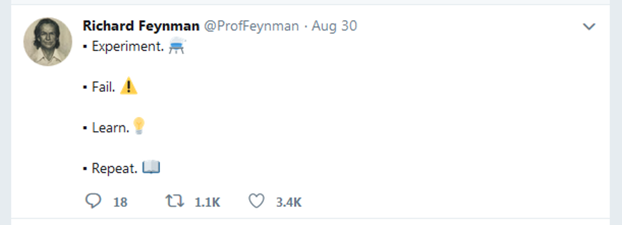
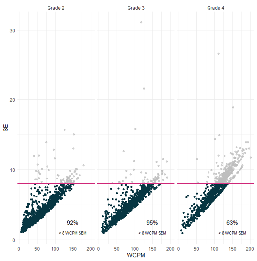
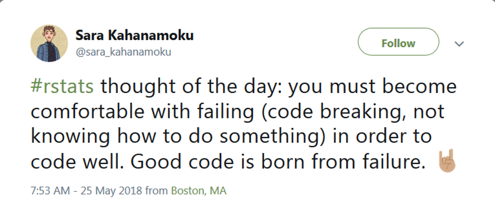
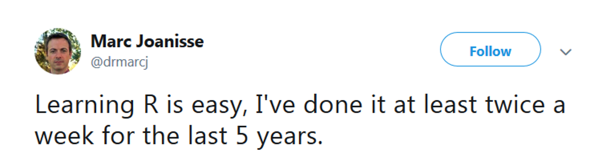

```{r setup, include=FALSE}
options(htmltools.dir.version = FALSE)

knitr::opts_chunk$set(echo = FALSE,
                      message = FALSE,
                      warning = FALSE)

library(xaringanthemer)
library(tidyverse)
library(knitr)
library(here)
library(kableExtra)

```

```{r xaringan-themer, include=FALSE, warning=FALSE}
style_duo_accent(
  primary_color = "#1F4E79",
  secondary_color = "#0072B2",
  header_font_google = google_font("Atkinson Hyperlegible", "600"),
  text_font_google   = google_font("Atkinson Hyperlegible", "300", "300i"),
  code_font_google   = google_font("IBM Plex Mono"),
  colors = c(
    darkblue = "#0072B2",
    lightblue = "#56B4E9",
    darkorange = "#D55E00",
    lightorange = "#E69f00",
    yellow = "F0E442",
    green = "#009E73",
    pink = "#CC79A7",
    gray = "999999",
    white = "#FFFFFF"
  )
)

```

---
class: inverse, left, middle

# Introduction to the Course
## Week 1

---

# Agenda

* Introductions
* Syllabus
* Introduce `R`

**Overall Purpose**

* Understand the course requirements
* Get you excited about `R`!

---

# About me

* BA: UC Santa Barbara
* PhD, School Psychology: University of Maryland
* Behavioral Research & Teaching ([BRT](http://brtprojects.org)) at UO since 2009
* Research Associate Professor
  
**Research**
* Applied statistical methods to measure and monitor student growth
* Inform the applied research methodologies used by researchers 
* Developing and improving systems that support data-based decision making using advanced technologies to influence teachers’ instructional practices and increase student achievement
  + [CORE](https://jnese.github.io/core-blog/) and [CORE II](https://jnese.github.io/coreprosody)
  
**Teaching**
* EDLD 651 - this one!
* EDLD 654 Applied Machine Learning for Educational Data Scientists
* EDLD 609 Data Science Capstone

---

# Courageous Conversations with Me

* Creating norms of openness, understanding, and development
* An opportunity for us to grow
* Assumes positive intent
* Critical for my work (and yours)

.footnote[
Credit: Dr. Rhonda Nese
]

---

# About you

Please introduce yourself 

* Name and program/year of study 
* How are you doing?
* Why you want to learn R?
* Tell me whatever you’d like me and the class to know (e.g., pronouns, circumstances)

---

# BEAN COUNT

content

---

# Why is R awesome?

--

**Data visualizations**
* `{ggplot2}` -- your default by the end of this class, really powerful
* `{plotly}` -- interactive data visualizations 
* `{shiny}` –- interactive data communications

--

**Web**
* `{blogdown}`, `{distill}`, `{bookdown}` –- build your own website
* `{rvest}` –- scrape web data

--

**Modeling**
* `{lme4}` –- multilevel modeling
* `{lavaan}` –- SEM
* `{tidymodels}` –- machine learning

--

**Workflow!**

---

class: center, middle

.center[

]

---

# Acknowledgements

This course, and much of the materials prepared and content presented, was originally developed by [Daniel Anderson](www.datalorax.com)

* [Alison Hill](https://twitter.com/apreshill), [Chester Ismay](https://twitter.com/old_man_chester), and [Andrew Bray](https://andrewpbray.github.io/) helped Daniel design the content for this course and the specialization as a whole

---

# What this class is about

### Celebrating successes!

--
<br>
<br>

.center[

]

---

--

# Dr. Richard Feynman

American theoretical physicist, Nobel Laureate

--

.center[

]

---

# What this class is about

### Celebrating failures!

--
<br>
<br>

.center[

]

---

# What does Richard Feynman have to say about failing?

--

.center[

]

---

# What this class is about

### Celebrating trying!

--
<br>
<br>
.center[

]

---

# Very smart person Richard Feynman said:

--

.center[

]

---

# What this class is about

### Learning to problem solve

--
<br>
<br>

.center[

]

---

# Richard?

--

.center[

]

---

# This class...

**Is**
* data visualization 
* data structuring and manipulations
* reproducible workflows
* a LOT (content and assignments at a fast pace)

**Is not**
* all encompassing 
* first of the series
* a statistics course 
  + but we'll use some stats in examples

---

# Shares

Sometimes I may ask people to share with the class something they have learned.

* A success, a new `{package}` or `function()`
* *Completely* voluntary
  + BUT, you might get a hex sticker 🎉

--
</br>
</br>
.center[

]

---

# A sharing example

.pull-left[
"I made this cool figure!

I used the `{gghighlight}` package for the first time!

And I annoted my facets separately!"
]

.pull-right[

]

---

# Another sharing example

.pull-left[
"I went to re-run my ‘cool figure’ a couple months later and my code did not work!

I spent [mumble mumble] minutes getting it to work again!"
]

.pull-right[

]

---

class: inverse, left, middle

# Syllabus

---

# Course Learning Outcomes

* Understand the R package ecosystem 
  + how to find, install, load, and learn about them
* Read "flat" (i.e., rectangular) datasets into `R` 
* Perform basic data manipulations / transformations in R with the `tidyverse`
  + leverage appropriate functions for introductory data science tasks
  + prepare data using scripts and reproducible workflows
* Use version control with `R` via git and GitHub
* Use R Markdown to create reproducible dynamic reports, including APA manuscripts
* Understand and create different types of data visualizations

---

# Course Site

**www.--------**

* slides (before each class)
* get assignments
* syllabus
* data?

**Canvas**

* submit assignments
* announcements
* data

---

# Required Textbooks (free)

.pull-left[
http://r4ds.had.co.nz

]

.pull-right[
https://happygitwithr.com/

]

---

# Books not required (but possibly helpful)

.pull-left[
https://clauswilke.com/dataviz/
{height=25%}
]

.pull-right[
https://socviz.co/
{height=25%}
]

---

### RStudio Primers, R-Bootcamp, & Codecademy

* Supplemental learning opportunities that I hope are helpful
* Part of your “Supplemental Learning” grade
* First time we are using Codecademy
* I will be interested in hearing your feedback
  + [Not using Datacamp](https://www.noamross.net/2019/04/12/datacamp-sexual-assault/)

---

# Resources

* [R-Ladies](https://rladies.org/)
  + Global organization to promote gender diversity in the R community
* [R-Ladies Portland](https://www.meetup.com/rladies-pdx/)
  + Local chapter
* R Users Groups
  + [Eugene](https://www.meetup.com/meetup-group-cwPiAlnB/(not very active)
  + [Portland](https://pdxrlang.com/)

---

# Resources (con't)

* Twitter
  + Very active community. Browse the [#rstats](https://twitter.com/hashtag/rstats?lang=en) hashtag, and/or see syllabus for some recommendations for follows.
* [RStudio Community](https://community.rstudio.com/)
  + Similar to [stackoverflow](https://stackoverflow.com/questions/tagged/r) but friendlier (great place to post questions)
  + Opinionated
  + RStudio-philosophy dominant (as is this class)
* [R4DS](https://www.jessemaegan.com/post/r4ds-the-next-iteration/)
  + Online group of supportive people all trying to learn R, using the same book we will be using for this class
  + [Tidy Tuesday](https://github.com/rfordatascience/tidytuesday): Data viz with open data each Tuesday. Follow along on Twitter [#tidytuesday](https://twitter.com/hashtag/tidytuesday?lang=en)

---

# Weekly Schedule

* Readings - do before class
* Homework - due before next class
  + You **can** work in groups on these

---

# Assignements

**Homework (200 points)**
* Homeworks – 10 labs, 10 points each (120 points)
* Supplemental Learning
  + RStudio Primers $/times$ 4
  + R-Bootcamp – $/times$ 2
  + Codeacademy - $/times$ 4
  + Screenshot of specific part of Supplemental Learning
  
**Final Project (200 points)**
* Outline (15 points)
* Draft Data Prep Script (25 points)
* Peer Review of Draft Data Prep Script (25 points)
* Final Project Presentation (25 points)
* Final Paper (110 points)

**400 points total**

---

# Grading

```{r, echo=FALSE}

read_csv(here("rubrics", "grades_rubric.csv")) %>% 
  mutate(across(everything(), ~ifelse(is.na(.), "", .))) %>% 
  kable(caption = "<b>Grading Components</b>") %>% 
  kable_classic(full_width = F) %>% 
  kable_styling(font_size = 14, position = "left")

```

---

# Homeworks

* Scored on a “best honest effort” basis
  + generally zero or full credit 
* If you find yourself stuck and unable to proceed, **please contact the instructors for help rather than submitting incomplete work**
  + Contacting the instructor is part of the “best honest effort” and can result in full credit for an assignment even if the work is not fully complete
* **If the assignment is not complete, and the student has not contacted the instructor for help, it is likely to result is a partial credit score or a zero** * Labs submitted late will be docked by 30% (3 points)
  + Labs are generally due the class after they are assigned, before class starts

---

# Final Project

* Group project, 3-4 people
* Rmarkdown document

**Final project must:**
* Be fully reproducible
  + This implies the data are open
* Be a collaborative project hosted on GitHub
* Move data from its raw "messy" format to a tidy data format
* Include at least two exploratory plots
* Include at least summary statistics of the data in tables, although fitted models are also encouraged

---

# Final Project - Dates

* Week 3  (10/20): Self-selected groups finalized
* Week 5  (11/3):  Final Project Outline due
* Week 8  (11/24): Data prep script due
* Week 9  (12/1):  Peer review due
* Week 10 (12/8):  Final project presentations
* Week 11 (12/15): Final Paper due

---

# Final Project - Paper Scoring Rubric

```{r, echo=FALSE}

read_csv(here("rubrics", "final-project_rubric.csv")) %>% 
  mutate(`Points Possible` = ifelse(is.na(`Points Possible`), "", `Points Possible`)) %>%
  knitr::kable() %>% 
  kableExtra::row_spec(c(1, 8, 12, 20), bold = TRUE) %>% 
  kableExtra::kable_styling(font_size = 10)
  
```

---

# Final Project - Outline

**Primary purpose:** Get feedback and give me a preview of your project

* Description of the data to be used
* Discussion of preparatory work that needs to be done
* How the requirements of the final project will be met
* Anything you want feedback on

---

# Final Project - Data Prep Script

* Expected to be a work in progress
* Provided to your peers so they can learn from you as much as you can learn from their feedback

**Peer Review**
* Understand the purpose of the exercise
* Conducted as a professional product
* Should be **very** encouraging 
* Zero tolerance policy for inappropriate comments

---

# Final Project - Presentation

**Order randomly assigned. Should cover the following:**
* Share your journey (everyone, at least for a minute or two)
* Discuss challenges you had along the way
* Celebrate your successes
* Discuss challenges you are still facing
* Discuss substantive findings
* Show off your cool figures!
* Discuss next `R` hurdle you want to address

---

# Final Project – Presentation Scoring Rubric

```{r, echo=FALSE}

read_csv(here("rubrics", "final-presentation_rubric.csv")) %>% 
  mutate(across(everything(), ~ifelse(is.na(.), "", .))) %>% 
  kable(caption = "<b>Final Presentation Rubric</b>") %>% 
  kable_classic(full_width = F) %>%
  row_spec(6, bold = TRUE) %>% 
  kable_styling(font_size = 14, position = "left")
```

---

# Final Projct - Paper

* Research Paper
  + Abstract, Intro, Methods, Results, Discussion
  + Should be brief: 3,500 words max 
* No code displayed - should look like any other manuscript being submitted for publication
* Include at least 1 table
* Include at least 2 plots
* Should be fully open, reproducible, and housed on GitHub
  + I should be able to clone your repository, open the R Studio Project, and reproduce the full manuscript (by knitting the R Markdown doc)

---

# git and GitHub

* Will be required for final project
* What is it?
  + Version control system
  + Collaboration tool
  + Can be powerful for transparency and reproducibility
  + More to come

* Think of a GitHub profile as a public resume and treat it as such
* [Username advice](https://happygitwithr.com/github-acct.html) from Jenny Bryan

--

This might be frustrating, but we’ll get through it together!

---

class: inverse, left, middle

# Welcome to `R`

---

# What is `R`

* `R` is an environment and programming language, created primarily for statistical analyses and graphics
* No point-and-click interface
* Open source
  + source code is freely available, and can be redistributed and modified
* Incredibly powerful and flexible
  + Vast array of external packages available for specilized functions (analyses, data visualizations, automate the data “cleaning" process)

---

class: center, middle



---

class: center, middle


---

class: center, middle



---

class: center, middle

> The bad news is that whenever you learn a new skill you're going to suck. It's going to be frustrating. The good news is that is typical and happens to everyone and it is only temporary. You can't go from knowing nothing to becoming an expert without going through a period of great frustration and great suckiness.

-- Hadley Wickham

---

# Moving to code/programming

.pull-left[
**Advantages**
* Flexibility
  + Essentially anything is possible
* Transparency
  + Documented history of your analysis
* Efficiency
  + Many tasks can be automated
]

--

.pull-right[
**Disadvantages**
* Steep learning curve
  + Definitely requires a significant time investment
  + Similar to learning a new language
* You will lose patience with point-and-click interfaces
* Likely to become "one of the converted"
]

---

# Code-based Interface

## `R`

### This is the `R` console


---

# Code-based Interface

## RStudio

### This is the RStudio IDE _(Integrated Development Environment)_


---

# How to learn `R`?

* Time
* Use it!
* Dedication and determination help
* Be patient and forgiving with yourself, it will feel slow at first
* I still get frustrated

---

# `R` as a big calculator

```{r}
3 + 2
```

```{r}
3 / (3+2)
```

---

# Object Assignment `<-`

Objects are stored in active memory of your computer with names that you provide

`<-` is the assignment operator

It is used to assign names to objects (like an `=` operator)

--

```{r}
a <- 3
b <- 2
a
```

--

```{r}
a + b
```

--

```{r}
a / (a + b)
```

---

# Re-assignment

```{r}
a <- 10
a
```

--

```{r}
a <- "EDLD 651"
a
```

---

# Data Types

Objects can be a variety of types

--

* character: `"Hello world!"` or `"EDLD 651"`

--

* numeric: `2` and/or `15.5`
  + decimal also called `double`

--

* integer: `2L` (the `L` tells `R` to store this as an integer)

--

* logical: `TRUE` or `FALSE`

--

These objects can be extremely useful in programming

---

# Objects

Objects can also be:
* variables, data sets, models, results, functions, figures, more…

You can then use or manipulate these in different ways
* e.g., plots, functions, operators (arithmetic, logical, comparison)

---

# `R` Functions

Anything that carries out an operation in R is a function, even `+`

Functions are generally followed by `()`
* `**package::function()**`
  + `sum()`
  + `lm()`
  + `sqrt()`

---

# Getting help

`?` before a function name can be very helpful (and also confusing early on)

* Helpful for understanding formal *arguments* of a function
  + *arguments* are options within a `function()`

`?function_name()`  

```{r, eval=FALSE}
?mutate() #(mutate() is a function in the dplyr package)

?dplyr::mutate()
```

---

background-image: url("./images/help_info.png")

.footnote[
[https://socviz.co/](https://socviz.co/)
]

---

# Getting help (con't)

* Resources on syllabus
* Your classmates!
* Me
  + Appointment by email
  + If you email me with a question, provide your R file
* Google

---

# Back to Dr. Feynman

(Isaac Asimov, really)


---
class: inverse, left, middle

# Installs

---

# Install Check

Install
* [R](https://cloud.r-project.org/)
* [Rstudio](https://www.rstudio.com/products/rstudio/#Desktop)
* [Git](https://www.git-scm.com/download)

Also
* [Register for GitHub account](https://github.com)
  + username [advice](https://happygitwithr.com/github-acct.html) from Jenny Bryan

---

---
class: inverse, left, middle

# Customize!

---

# Customize your RStudio Display!

**Tools 🡆 Global Options...**

General
* Workspace
  + “*Restore .RData into workspace at startup*” -- **Uncheck**
  + "*Save workspace to .RData on exit:*" -- **Never**
* History
  + "*“Always save history (even when not saving .RData)*" -- **Check**
* Appearance 
  + Font, font size
  + Editor theme!!
* Pane Layout
* Code
  + Highlight R function calls (up to you)
  + Show indent guides (up to you)

---

# Keyboard Shortcuts

There are a lot...

**Tools 🡆 Keyboard Shortcuts Help** (Alt+Shift+K)

**Tools 🡆 Modify Keyboard Shortcuts**

My favorites (for Macs, sub Command for Ctrl)
* `Ctrl + Enter` = run code
* `Ctrl + Shift + M` = insert pipe (`%>%`)
* `Ctrl + Alt + I` = insert code chunk in R Markdown
* `Ctrl + Shift + C` = comment a block

Other good ones
* `Alt + -` = insert assignment operator (<-)
* `Ctrl + Shift + Alt + Up/Down` = add cursor above/below current cursor

**.darkorange[demo]**


---
class: inverse, left, middle

# `R` Packages

---

# The data science pipeline


.footnote[
[R4DS](https://r4ds.had.co.nz/explore-intro.html)
]

--

### How do we go about this?

---

# "Out of the box" functionality

`R` Packages provide functions (and datasets) for you to use

Some packages are pre-loaded
* `{base}`
* `{graphics}`
* `{stats}`

Some packages are pre-installed
* `{boot}`
* `{MASS}`
* `{Matrix}`

---

# Pre-loaded vs Installed

Pre-loaded packages work on launch

For example, `plot()` is part of the `{graphics}` package, which ships with `R`
--

```{r, fig.height=5}
plot(x = 1:10, y = 1:10)
```

---

# `{base}` package

* All functions come from a package

--

* What do you get with the following?

`?'+'`

---

background-image: url("./images/plus_help.png")

---

# Packages on CRAN

There is a TON of functionality that comes with R right from your initial download **BUT** the functionality can be extended by installing other packages

--

CRAN is the official repository
* a network of servers maintained by the R community around the world
* coordinated by the [R Foundation](https://www.r-project.org/foundation/)
* a package needs to pass several tests to be published on CRAN

--

Most often, you will first install a package, then load it
* `install.packages(“package_name”)`
* `library(package_name)`

--

You will only need to install a package one time (generally). After that, it is in your library, and only needs to be loaded

--

Currently, the CRAN package repository features 18,000+ packages
* 16,300+ last year at this time
* constantly evolving to keep up with the varied demands of the data science community

---

# One more time

--

`install.packages(“package_name”)`

--

* you will only need to do this the FIRST time you use the package
* don’t keep this code line (you can run it in the console, or delete it from your script)
* notices the quotes

--

`library(package_name)`

--

* you will do this each time you use the package in your scripts
* notices no quotes

---

# Other packages

On GitHub

* Popular repository for open source projects
  + Integrated with git (version control)
  + Easy to share/collaborate
* Not necessarily `R` specific
* Generally, these packages “in development,” or are the beta versions of existing packages
* No review process associated with GitHub

---

# Possibilities

With just a basic knowledge of R you have access to thousands of packages 
* Expanding on a daily basis
* Provides access to cutting edge and specialized functionality for analysis, data visualization, and data preparation
* Some of the most modern thinking on data analysis topics are often represented in these packages

---
background-size: contain

background-image: url("./images/packages.png")

---
class: inverse, left, middle

# Let's dive in

## (or end here for today)

---

# How do we access variables?

* Generally, in this course, with `{tidyverse}` tools
* Sometimes with `$` or with `[]`
  + `data_name$variable_name`
  + `data_name["variable_name"]`

--

Let's load the tidyverse, and then we'll access some variables from the datasets within some of those packages
* Look at the gss_cat data frame

```{r}
# if you have never installed the {tidyverse} package, you will need to do that first
#install.packages(“tidyverse”) 

library(tidyverse)

gss_cat
```

---

# Selecting varaibles

Select the `marital` variable with `$`

--

```{r}
gss_cat$marital
```

---

# Look at the `str`ucture of an object

```{r}
str(gss_cat$marital)
```

--

```{r}
str(gss_cat)
```

---

## Because `gss_cat` is a `tibble`

```{r}
gss_cat
```

---

# When to use `$`?

* Often when you need to use `{base} R` 
* Execute a funtion casually

--

.pull-left[
```{r}
table(gss_cat$marital)
```
]

--

.pull-right[
```{r}
hist(gss_cat$age)
```
]

---

# Your turn

Run `table()` on the `religion` variable

Produce a `hist`ogram of the `tvhours` variable

---

# The pipe operator (`%>%`)

* The `%>%` operator (Super + Shift + M) inserts the input from the left as the first argument in the next function
* To start, you can read it as, “then”
* It is crucial for work in the `{tidyverse}`

--

```{r}
gss_cat %>% 
  count(marital)
```

--

We will talk about this a lot more later

---

# Why use `%>%`

Chaining arguments is **efficient** and **easy to read**

--

```{r}
gss_cat %>% 
  filter(relig == "Buddhism",
         age > 55) %>% 
  select(age, partyid, rincome) %>% 
  arrange(age) %>% 
  slice(1:5)
```

--

Equivalent to:

```{r, eval=FALSE}
slice(arrange(select(filter(gss_cat, relig == "Buddhism", age > 55), age, partyid, rincome), age), 1:5)
```

---
class: inverse, left, middle

# Next time

---

# Before next class
